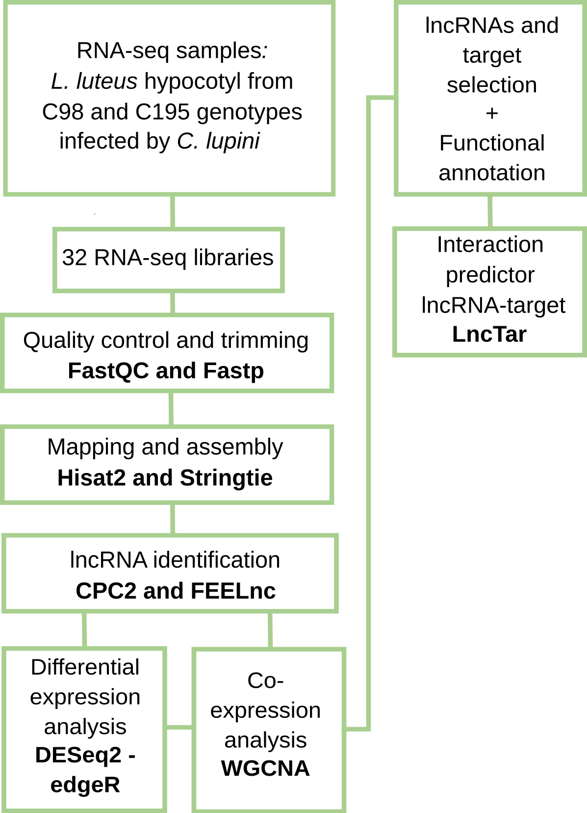

# lncRNA identification and Co-expression analyses

## Overview

This repository provides a complete computational framework to identify
lncRNAs and putative regulatory interactions between lncRNAs and
protein-coding genes by integrating:

-   Two lncRNA prediction tools (FEELnc and CPC2) to increase confidence
    in results
-   Two differential expression analysis tools (DESeq2 and edgeR)
-   Co-expression network analysis (WGCNA)
  

------------------------------------------------------------------------

## Repository Structure

    ├── 01_preprocessing/
    │   ├── run01_fastp_trimming.py
    │   ├── run02_hisat_mapping.py
    │   ├── run03_stringtie_assembly.sh
    │   └── run04_gffcompare.sh
    ├── 02_lncRNA_identification/
    │   └── run05_FEELnc_CPC2_lncRNAprediction.txt
    ├── 03_differential_expression_analysis/
    │   ├── run06_featurecounts.sh
    │   └── run07_EdgeR_DESEQ2_DEanalysis.ipynb
    ├── 04_coexpression_WGCNA_analysis/
    │   └── run08_WGCNA_coexpanalysis.ipynb
    ├── 05_network_filtering/
    │   ├── run09_coexp_data_filter.ipynb
    │   ├── run10_genepairs_net_construction.py
    │   ├── run11_quantilnetwork_to_cytoscape.py
    │   ├── run12_edges_attributes1_pairsxtrait.py
    │   ├── run13_edges_attributes2_to_cytoscape.ipynb
    │   ├── run14_nodes_attributes_to_cytoscape.ipynb
    │   └── run15_annotation_nodes_of_interest.ipynb
    └── README.md

**Note:** The modules must be executed in order.

------------------------------------------------------------------------

## Pipeline Overview

### Step 01 - Preprocessing

#### `run01_fastp_trimming.py`

**Input:** - Raw paired-end reads (forward and reverse)

Example:

    your_path/sample1_1.fastq.gz    your_path/sample1_2.fastq.gz

**Output:** - Trimmed reads

------------------------------------------------------------------------

#### `run02_hisat_mapping.py`

**Input:** - Trimmed reads - Reference genome index

Example:

    ../sample1_paired1.fq.gz    ../sample1_paired2.fq.gz

Build index:

    hisat2-build reference_genome.fasta index_output

**Output:** - `.bam` files

------------------------------------------------------------------------

#### `run03_stringtie_assembly.sh`

**Input:** - `.bam` - `ref_genome.gtf`

**Output:** - `stringtie_merged.gtf`

------------------------------------------------------------------------

#### `run04_gffcompare.sh`

**Input:** - `ref_genome.gtf` - `stringtie_merged.gtf`

**Output:** - Comparison data

------------------------------------------------------------------------

### Step 02 - lncRNA Identification

#### `run05_FEELnc_CPC2_lncRNAprediction.txt`

**Input:** - `ref_genome.gtf` - `stringtie_merged.gtf`

**Output:** - Common lncRNAs

------------------------------------------------------------------------

### Step 03 - Differential Expression Analysis

#### `run06_featurecounts.sh`

**Input:** - `.bam`

**Output:** - `count_matrix.tsv`

------------------------------------------------------------------------

#### `run07_EdgeR_DESEQ2_DEanalysis.ipynb`

**Input:** - `count_matrix.tsv` - `metadata.txt`

**Output:** - DE genes, PCA, heatmaps

------------------------------------------------------------------------

### Step 04 - Co-expression Analysis

#### `run08_WGCNA_coexpanalysis.ipynb`

**Input:** - `TMM.tsv` - `metadata.txt` - `binary_traits.tsv`

**Output:** - Network files and plots

------------------------------------------------------------------------

### Step 05 - Network Filtering

#### `run09_coexp_data_filter.ipynb`

**Input:** - `geneModuleMembership.csv` - `PvalueModuleMembership.csv` - `geneTraitSignificance_resistant.csv` - `GeneSignificancePvalue_resistant.csv ` 

**Output:** - `filtered_mm.tsv`

------------------------------------------------------------------------

#### `run10_genepairs_net_construction.py`

**Input:** - `list_genes_of_interest.txt` 

**Output:** - `gene_list_pairs.txt`

------------------------------------------------------------------------

#### `run11_quantilnetwork_to_cytoscape.py`

**Input:** - `bigNet_edges.txt`

**Output:** - Filtered networks

------------------------------------------------------------------------

#### `run12_edges_attributes1_pairsxtrait.py`

**Input:** - `filtered_network.txt` - `gene_list_pairs.txt`

**Output:** - Weighted gene pairs

------------------------------------------------------------------------

#### `run13_edges_attributes2_to_cytoscape.ipynb`

**Input:** - `bignet_075_resistant.txt` - `bignet_075_resistant24hpi.txt` - `bignet_075_resistant60hpi.txt` - `bignet_075_resistant84hpi.txt` - pairs genes with weight info. 

**Output:** - `edges_attributes.tsv`

------------------------------------------------------------------------

#### `run14_nodes_attributes_to_cytoscape.ipynb`

**Input:** - `filtered_mm.tsv ` - `genes_DE_run07.txt` - any list of genes attributes 

**Output:** - `node_attributes.tsv`

------------------------------------------------------------------------

#### `run15_annotation_nodes_of_interest.ipynb`

**Input:** - `annotation_file.tsv ` - `list_nodes.txt` - `list_edges.txt`

**Output:** - `annotated_genes.tsv`

------------------------------------------------------------------------

## Software and tools 

- R v4.5.1.
- Python v3.10.
- FastQC v0.11.9 [1]
- MultiQC v.1.23 [2]
- Fastp v0.23.2 [3]
- Hisat2 v2.2.165 [4]
- Stringtie v2.2.2 [5]
- Gffcompare v0.11.2 [6]
- CPC2 v1.0.1 [7] 
- FEELnc v3 [8]
- FeatureCounts v1.22.2 [9]
- edgeR v4.6.3 [10] 
- DESeq2 v1.48.1 [11] 
- BiNGO tool [12] 
- Cytoscape v3.10.2 [13]
- GOATOOLS [14]
- WGCNA package v.1.73 [15]
- InterProscan v5.62-94.0 [16]
- EggNOG v5.0.2 [17]
- BLAST v2.14.1 [18]
- UniProt [19]
- LncTar v1.0 [20] 

#### References 

1. Andrews S. FastQC: a quality control tool for high throughput sequence data. Available Online Httpwwwbioinformaticsbabrahamacukprojectsfastqc. 2010. 
2. Ewels P, Magnusson M, Lundin S, Käller M. MultiQC: summarize analysis results for multiple tools and samples in a single report. Bioinformatics. 2016;32:3047–8. https://doi.org/10.1093/bioinformatics/btw354. 
3. Chen S. Ultrafast one-pass FASTQ data preprocessing, quality control, and deduplication using fastp. iMeta. 2023;2. https://doi.org/10.1002/imt2.107. 
4. Kim D, Paggi JM, Park C, Bennett C, Salzberg SL. Graph-based genome alignment and genotyping with HISAT2 and HISAT-genotype. Nat Biotechnol. 2019;37:907–15. https://doi.org/10.1038/s41587-019-0201-4. 
5. Pertea M, Pertea GM, Antonescu CM, Chang TC, Mendell JT, Salzberg SL. StringTie enables improved reconstruction of a transcriptome from RNA-seq reads. Nat Biotechnol. 2015;33:290–5. https://doi.org/10.1038/nbt.3122. 
6. Pertea M, Pertea G. GFF Utilities: GffRead and GffCompare. F1000Research. 2020;9. https://doi.org/10.12688/f1000research.23297.1. 
7. Kang YJ, Yang DC, Kong L, Hou M, Meng YQ, Wei L, et al. CPC2: A fast and accurate coding potential calculator based on sequence intrinsic features. Nucleic Acids Res. 2017;45:W12–6. https://doi.org/10.1093/nar/gkx428. 
8. Wucher V, Legeai F, Hédan B, Rizk G, Lagoutte L, Leeb T, et al. FEELnc: A tool for long non-coding RNA annotation and its application to the dog transcriptome. Nucleic Acids Res. 2017;45. https://doi.org/10.1093/nar/gkw1306. 
9. Liao Y, Smyth GK, Shi W. FeatureCounts: An efficient general purpose program for assigning sequence reads to genomic features. Bioinformatics. 2014;30:923–30. https://doi.org/10.1093/bioinformatics/btt656. 
10. Robinson MD, McCarthy DJ, Smyth GK. edgeR: A Bioconductor package for differential expression analysis of digital gene expression data. Bioinformatics. 2009;26:139–40. https://doi.org/10.1093/bioinformatics/btp616. 
11. Assefa AT, De Paepe K, Everaert C, Mestdagh P, Thas O, Vandesompele J. Differential gene expression analysis tools exhibit substandard performance for long non-coding RNA-sequencing data. Genome Biol. 2018;19. https://doi.org/10.1186/s13059-018-1466-5. 
12. Maere S, Heymans K, Kuiper M. BiNGO: A Cytoscape plugin to assess overrepresentation of Gene Ontology categories in Biological Networks. Bioinformatics. 2005;21:3448–9. https://doi.org/10.1093/bioinformatics/bti551. 
13. Shannon P, Markiel A, Ozier O, Baliga NS, Wang JT, Ramage D, et al. Cytoscape: A software Environment for integrated models of biomolecular interaction networks. Genome Res. 2003;13:2498–504. https://doi.org/10.1101/gr.1239303. 
14. Klopfenstein DV, Zhang L, Pedersen BS, Ramírez F, Warwick Vesztrocy A, Naldi A, et al. GOATOOLS: A Python library for Gene Ontology analyses. Sci Rep. 2018;8:10872. https://doi.org/10.1038/s41598-018-28948-z. 
15. Langfelder P, Horvath S. WGCNA: An R package for weighted correlation network analysis. BMC Bioinformatics. 2008;9. https://doi.org/10.1186/1471-2105-9-559. 
16. Quevillon E, Silventoinen V, Pillai S, Harte N, Mulder N, Apweiler R, et al. InterProScan: Protein domains identifier. Nucleic Acids Res. 2005;33 SUPPL. 2. https://doi.org/10.1093/nar/gki442. 
17. Huerta-Cepas J, Szklarczyk D, Heller D, Hernández-Plaza A, Forslund SK, Cook H, et al. EggNOG 5.0: A hierarchical, functionally and phylogenetically annotated orthology resource based on 5090 organisms and 2502 viruses. Nucleic Acids Res. 2019;47:D309–14. https://doi.org/10.1093/nar/gky1085. 
18. Altschul SF, Gish W, Miller W, Myers EW, Lipman DJ. Basic local alignment search tool. J Mol Biol. 1990;215:403–10. https://doi.org/10.1016/S0022-2836(05)80360-2. 
19. Bateman A, Martin MJ, Orchard S, Magrane M, Ahmad S, Alpi E, et al. UniProt: the Universal Protein Knowledgebase in 2023. Nucleic Acids Res. 2023;51:D523–31. https://doi.org/10.1093/nar/gkac1052. 
20. Li J, Ma W, Zeng P, Wang J, Geng B, Yang J, et al. LncTar: A tool for predicting the RNA targets of long noncoding RNAs. Brief Bioinform. 2014;16:806–12. https://doi.org/10.1093/bib/bbu048. 

------------------------------------------------------------------------

