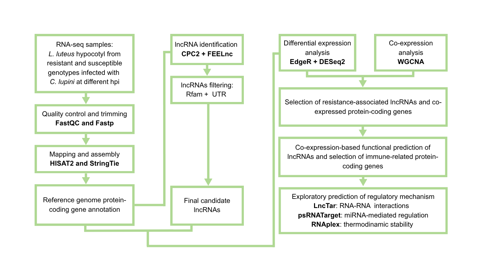

# lncRNA identification and Co-expression analyses

## Overview

This repository contains the computational workflow and analysis scripts used to identify candidate lncRNAs and infer putative regulatory interactions between lncRNAs and protein-coding genes by integrating:

-   Two lncRNA prediction tools (FEELnc and CPC2) and filtering steps.
-   Two differential expression analysis tools (DESeq2 and edgeR)
-   Co-expression network analysis (WGCNA)
  

------------------------------------------------------------------------

## Repository Structure

    ├── 01_preprocessing/
    │   ├── run01_fastp_trimming.py
    │   ├── run02_hisat_mapping.py
    │   ├── run03_stringtie_assembly.sh
    │   └── run04_gffcompare.sh
    ├── 02_lncRNA_identification/
    │   └── run05_lncRNAprediction.txt
    ├── 03_differential_expression_analysis/
    │   ├── run06_featurecounts.sh
    │   └── run07_contrast1_ctvshpi.ipynb
    │   └── run07_contrast2_RvsS.ipynb
    ├── 04_coexpression_WGCNA_analysis/
    │   └── run08_WGCNA_coexpanalysis.ipynb
    ├── 05_network_filtering/
    │   ├── run09_coexp_data_filter.ipynb
    │   ├── run10_genepairs_net_construction.py
    │   ├── run11_quantilnetwork_to_cytoscape.py
    │   ├── run12_edges_attributes1_pairsxtrait.py
    │   ├── run13_edges_attributes2_to_cytoscape.ipynb
    │   ├── run14_nodes_attributes_to_cytoscape.ipynb
    │   └── run15_annotation_nodes_of_interest.ipynb
    ├── 06_regulatory_prediction.txt
    └── README.md

**Note:** The modules must be executed in order.

------------------------------------------------------------------------

## Pipeline Overview

### Step 01 - Preprocessing

#### `run01_fastp_trimming.py`

**Input:** - Raw paired-end reads (forward and reverse)

Example:

    your_path/sample1_1.fastq.gz    your_path/sample1_2.fastq.gz

**Output:** - Trimmed reads

------------------------------------------------------------------------

#### `run02_hisat_mapping.py`

**Input:** - Trimmed reads - Reference genome index

Example:

    ../sample1_paired1.fq.gz    ../sample1_paired2.fq.gz

Build index:

    hisat2-build reference_genome.fasta index_output

**Output:** - `.bam` files

------------------------------------------------------------------------

#### `run03_stringtie_assembly.sh`

**Input:** - `.bam` - `ref_genome.gtf`

**Output:** - `stringtie_merged.gtf`

------------------------------------------------------------------------

#### `run04_gffcompare.sh`

**Input:** - `ref_genome.gtf` - `stringtie_merged.gtf`

**Output:** - Comparison data

------------------------------------------------------------------------

### Step 02 - lncRNA Identification

#### `run05_lncRNAprediction.txt`

**Input:** - `ref_genome.gtf` - `stringtie_merged.gtf` - `reference_genome_with_UTR.gff`

**Output:** - candidate lncRNAs

------------------------------------------------------------------------

### Step 03 - Differential Expression Analysis

#### `run06_featurecounts.sh`

**Input:** - `.bam`

**Output:** - `count_matrix.tsv`

------------------------------------------------------------------------

#### `run07_EdgeR_DESEQ2_DEanalysis.ipynb`

**Input:** - `count_matrix.tsv` - `metadata.txt`

**Output:** - DE genes: infection-associated, PCA, heatmaps

#### `run07_EdgeR_DESEQ2_DEanalysis.ipynb`

**Input:** - `count_matrix.tsv` - `metadata.txt`

**Output:** - DE genes: genotype-associated, PCA, heatmaps
------------------------------------------------------------------------

### Step 04 - Co-expression Analysis

#### `run08_WGCNA_coexpanalysis.ipynb`

**Input:** - `TMM.tsv` - `metadata.txt` - `binary_traits.tsv`

**Output:** - Network files and plots

------------------------------------------------------------------------

### Step 05 - Network Filtering

#### `run09_coexp_data_filter.ipynb`

**Input:** - `geneModuleMembership.csv` - `PvalueModuleMembership.csv` - `geneTraitSignificance_resistant.csv` - `GeneSignificancePvalue_resistant.csv ` 

**Output:** - `filtered_mm.tsv`

------------------------------------------------------------------------

#### `run10_genepairs_net_construction.py`

**Input:** - `list_genes_of_interest.txt` 

**Output:** - `gene_list_pairs.txt`

------------------------------------------------------------------------

#### `run11_quantilnetwork_to_cytoscape.py`

**Input:** - `bigNet_edges.txt`

**Output:** - Filtered networks

------------------------------------------------------------------------

#### `run12_edges_attributes1_pairsxtrait.py`

**Input:** - `filtered_network.txt` - `gene_list_pairs.txt`

**Output:** - Weighted gene pairs

------------------------------------------------------------------------

#### `run13_edges_attributes2_to_cytoscape.ipynb`

**Input:** - `bignet_075_resistant.txt` - `bignet_075_resistant24hpi.txt` - `bignet_075_resistant60hpi.txt` - `bignet_075_resistant84hpi.txt` - pairs genes with weight info. 

**Output:** - `edges_attributes.tsv`

------------------------------------------------------------------------

#### `run14_nodes_attributes_to_cytoscape.ipynb`

**Input:** - `filtered_mm.tsv ` - `genes_DE_run07.txt` - any list of genes attributes 

**Output:** - `node_attributes.tsv`

------------------------------------------------------------------------

#### `run15_annotation_nodes_of_interest.ipynb`

**Input:** - `annotation_file.tsv ` - `list_nodes.txt` - `list_edges.txt`

**Output:** - `annotated_genes.tsv`

------------------------------------------------------------------------

### Step 06 - Regulatiory prediction

#### `run16_regulatory_prediction.txt`

**Input:** - `lncRNA.fasta` - `protein-coding-genes.fasta` - `miRNAs.fasta` 

**Output:** - `lncTar results, RNAplex, psRNAtarget output`

------------------------------------------------------------------------

## Software and tools 

- R v4.5.1.
- Python v3.10.
- FastQC v0.11.9 [1]
- MultiQC v.1.23 [2]
- Fastp v0.23.2 [3]
- Hisat2 v2.2.165 [4]
- Stringtie v2.2.2 [5]
- Gffcompare v0.11.2 [6]
- CPC2 v1.0.1 [7] 
- FEELnc v3 [8]
- FeatureCounts v1.22.2 [9]
- edgeR v4.6.3 [10] 
- DESeq2 v1.48.1 [11] 
- WGCNA package v.1.73 [12]

#### References 

1. Andrews S. FastQC: a quality control tool for high throughput sequence data. Available Online Httpwwwbioinformaticsbabrahamacukprojectsfastqc. 2010. 
2. Ewels P, Magnusson M, Lundin S, Käller M. MultiQC: summarize analysis results for multiple tools and samples in a single report. Bioinformatics. 2016;32:3047–8. https://doi.org/10.1093/bioinformatics/btw354. 
3. Chen S. Ultrafast one-pass FASTQ data preprocessing, quality control, and deduplication using fastp. iMeta. 2023;2. https://doi.org/10.1002/imt2.107. 
4. Kim D, Paggi JM, Park C, Bennett C, Salzberg SL. Graph-based genome alignment and genotyping with HISAT2 and HISAT-genotype. Nat Biotechnol. 2019;37:907–15. https://doi.org/10.1038/s41587-019-0201-4. 
5. Pertea M, Pertea GM, Antonescu CM, Chang TC, Mendell JT, Salzberg SL. StringTie enables improved reconstruction of a transcriptome from RNA-seq reads. Nat Biotechnol. 2015;33:290–5. https://doi.org/10.1038/nbt.3122. 
6. Pertea M, Pertea G. GFF Utilities: GffRead and GffCompare. F1000Research. 2020;9. https://doi.org/10.12688/f1000research.23297.1. 
7. Kang YJ, Yang DC, Kong L, Hou M, Meng YQ, Wei L, et al. CPC2: A fast and accurate coding potential calculator based on sequence intrinsic features. Nucleic Acids Res. 2017;45:W12–6. https://doi.org/10.1093/nar/gkx428. 
8. Wucher V, Legeai F, Hédan B, Rizk G, Lagoutte L, Leeb T, et al. FEELnc: A tool for long non-coding RNA annotation and its application to the dog transcriptome. Nucleic Acids Res. 2017;45. https://doi.org/10.1093/nar/gkw1306. 
9. Liao Y, Smyth GK, Shi W. FeatureCounts: An efficient general purpose program for assigning sequence reads to genomic features. Bioinformatics. 2014;30:923–30. https://doi.org/10.1093/bioinformatics/btt656. 
10. Robinson MD, McCarthy DJ, Smyth GK. edgeR: A Bioconductor package for differential expression analysis of digital gene expression data. Bioinformatics. 2009;26:139–40. https://doi.org/10.1093/bioinformatics/btp616. 
11.  Love MI, Huber W, Anders S. Moderated estimation of fold change and dispersion for RNA-seq data with DESeq2. Genome Biol. 2014;15(12):550. https://doi.org/10.1186/s13059-014-0550-8.
12. Langfelder P, Horvath S. WGCNA: An R package for weighted correlation network analysis. BMC Bioinformatics. 2008;9. https://doi.org/10.1186/1471-2105-9-559. 

------------------------------------------------------------------------

